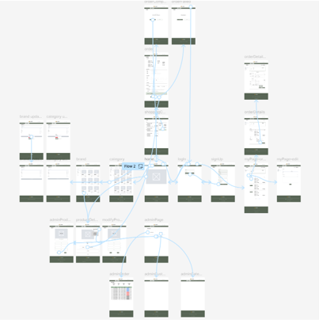

# 

 늘짝늘짝

## 목차

1. [개발 기간](#개발-기간)
2. [배포 주소](#배포-주소)
3. [프로젝트 목적](#프로젝트-목적)
4. [프로젝트 기능 명세](#프로젝트-기능-명세)
5. [ERD](#erd)
6. [WireFrame](#wireframe)
7. [기술 스택](#기술-스택)
8. [역할 분담](#역할-분담)

***
## 개발 기간
 24.05.27 ~ 06.01

***
## 배포 주소

http://34.47.79.214/

* * *
## 프로젝트 목적
* 캠핑 관련 장비 구매 가능한 온라인 쇼핑몰 서비스를 구현

***
### 프로젝트 기능 명세

### 1. 유저 기능
* Spring Security + JWT 기반 사용자 인증/인가
* 회원
  * 회원 가입 시 비밀번호 암호화
  * 중복 이메일 불가
  * 소프트 딜리트로 회원 탈퇴 기능 구현
* 로그인
  * 로그인 시 Token 발급
### 2. 캥핌용품 카테고리 기능
* 사용자
  * 특정 카테고리 검색가능
  * 특정 카테고리를 선택할 시, 해당 카테고리에 속한 상품 목록이 화면에 나타남
* 관리자
  * 관리자는 관리페이지에서 카테고리 추가,수정,삭제 가능
### 3. 주문 기능
* 사용자
  * 개인 페이지에서 주문 내역 조회, 수정, 취소 가능
* 관리자
  * 관리 페이지에서 사용자들의 주문 내역을 조회 가능
  * 사용자의 주문 내역에서 배송 상태를 수정 가능
### 4. 장바구니 기능
* 장바구니 데이터는 localStorage에서 관리
* 사용자
  * 장바구니에 상품을 추가, 수정 가능
  * 장바구니의 물픔을 일부, 전체 삭제 가능
  * 장바구니의 총 가격을 확인 가능

***
## ERD

***

### WireFrame

***
## 기술 스택

백엔드

프론트엔드

서버

ML

***
### 역할 분담

| | 이름  | 역할                                                     |
|---|-----|--------------------------------------------------------|
|  | 박원정 | 머신러닝 모델 및 전용 서버 구축 유저 관계 시스템(친구) 구현                |
| | 고의성 | 회원 인증/인가 처리                                            |
| | 김경래 | amazon s3을 이용한 프로필 이미지 설정 구현   google analytics 연동 |
|  | 김연지 | 게시글 CRUD 구현                                            |
|  | 김이삭 | 채팅 기능 구현                                               |
| | 조한휘 | 게임리스트 CRUD 구현       프론트 레이아웃 구현                    |

